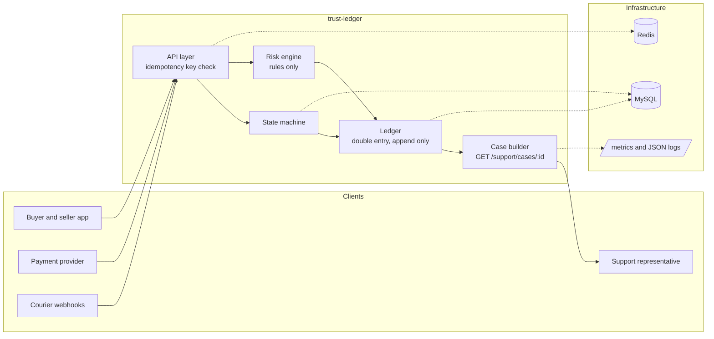

# Architecture

One Rails service. The support endpoint returns a decision with its reason,
not raw rows.

```mermaid
flowchart LR
    subgraph clients [Clients]
        BUYER[Buyer and seller app]
        PAY[Payment provider]
        COURIER[Courier webhooks]
        SUP[Support representative]
    end

    subgraph service [trust-ledger]
        API[API layer<br/>idempotency key check]
        SM[State machine]
        RISK[Risk engine<br/>rules only]
        LEDGER[Ledger<br/>double entry, append only]
        CASE[Case builder<br/>GET /support/cases/:id]
    end

    subgraph infra [Infrastructure]
        DB[(MySQL)]
        REDIS[(Redis)]
        OBS[/metrics and JSON logs/]
    end

    BUYER --> API
    PAY --> API
    COURIER --> API
    API --> SM
    API --> RISK
    SM --> LEDGER
    RISK --> LEDGER
    LEDGER --> CASE
    CASE --> SUP
    SM -.-> DB
    LEDGER -.-> DB
    API -.-> REDIS
    CASE -.-> OBS
```
