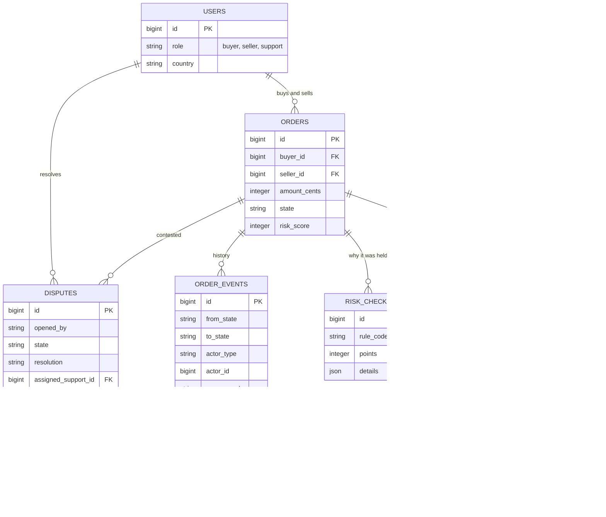

# Database

`orders` holds the current state only. `order_events` holds how it got there
and is never updated or deleted.

```mermaid
erDiagram
    USERS ||--o{ ORDERS : "buys and sells"
    USERS ||--o{ DISPUTES : "resolves"
    ORDERS ||--o{ ORDER_EVENTS : "history"
    ORDERS ||--o{ RISK_CHECKS : "why it was held"
    ORDERS ||--o{ LEDGER_TRANSACTIONS : "money"
    ORDERS ||--o{ DISPUTES : "contested"
    LEDGER_TRANSACTIONS ||--o{ LEDGER_ENTRIES : "must sum to zero"

    USERS {
        bigint id PK
        string role "buyer, seller, support"
        string country
    }
    ORDERS {
        bigint id PK
        bigint buyer_id FK
        bigint seller_id FK
        integer amount_cents
        string state
        integer risk_score
    }
    ORDER_EVENTS {
        bigint id PK
        string from_state
        string to_state
        string actor_type
        bigint actor_id
        string reason_code
    }
    LEDGER_TRANSACTIONS {
        bigint id PK
        string kind
        string idempotency_key UK
    }
    LEDGER_ENTRIES {
        bigint id PK
        string account
        integer amount_cents "minus is debit"
    }
    RISK_CHECKS {
        bigint id PK
        string rule_code
        integer points
        json details
    }
    DISPUTES {
        bigint id PK
        string opened_by
        string state
        string resolution
        bigint assigned_support_id FK
    }
```
